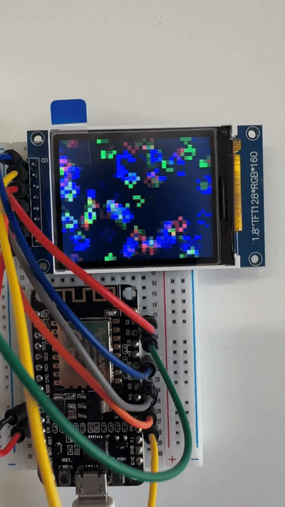
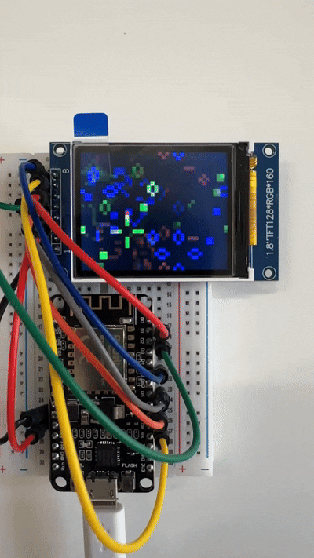
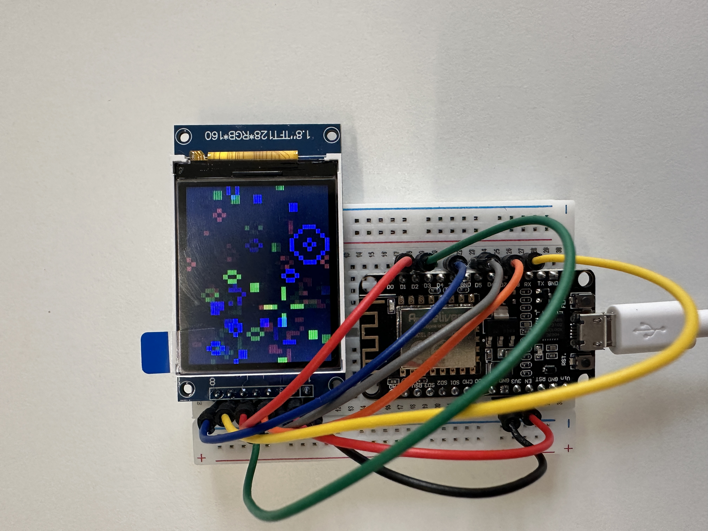

# Colorful Game of Life - Arduino TFT Edition

This project implements a **Conway's Game of Life (GOL)** version on an embedded platform (ESP8266), using bitwise manipulation to simulate multiple parallel color universes.

## Preview

Animated gameplay:

---

## Core Algorithm & Bitwise Implementation

The simulation is performed using bit-level parallelism techniques:

* **24-Simultaneous Bitwise Architecture:** The implementation runs 24 concurrent GOL instances, treating each bit of the RGB channels as an independent cell.
* **Rule Decoding (Bitmasking):** The `RULE` variable is interpreted as an 18-bit bitmask. The code uses bit shifts (`>>`) to directly check whether a cell should be born (bits 0-8) or survive (bits 9-17).
* **Memory Conversion (Pointer Arithmetic):** Pointer arithmetic and casting to `uint8_t*` are used to access the R, G, or B bytes of neighboring pixels efficiently and generically.
* **Embedded Optimization:** The main loop runs at maximum SPI bus speed (40 MHz) with static arrays to avoid heap fragmentation on the ESP8266.

---

## Requirements

* ESP8266 Microcontroller (NodeMCU 1.0)
* 1.8" TFT Display (ST7735 driver)
* [`TFT_eSPI` library](https://github.com/Bodmer/TFT_eSPI)
* Base code originally derived as part of a lab challenge in academic projects (CS61C).

---

## Schematics (Final Wiring)

The setup uses the ESP8266 hardware SPI:

| Display Pin | Function | ESP8266 Pin (GPIO) |
| :--- | :--- | :--- |
| **7 CS** | Chip Select | D8 (GPIO 15) |
| **6 DC** | Data/Cmd | D1 (GPIO 5) |
| **5 RES** | Reset | D2 (GPIO 4) |
| **4 SDA** | Data (MOSI) | D7 (GPIO 13) |
| **3 SCK** | Clock | D5 (GPIO 14) |
| **2 VCC** | Power | 3.3V |
| **1 GND** | Ground | GND |
---

## Simulation Settings (Constants)

| Variable | Value | Description |
| :--- | :--- | :--- |
| `GRID_W` x `GRID_H` | 32 x 40 | Simulation board dimensions (4x4 pixels per cell). |
| `CELL_SIZE` | 4 | Cell size in pixels (4x4). |
| `LIFE_INIT` | 10 | Percentage of alive cells at initialization (10%). |
| `RULE` | 0x1808 | Standard birth/survival rule (Bitmask). |
